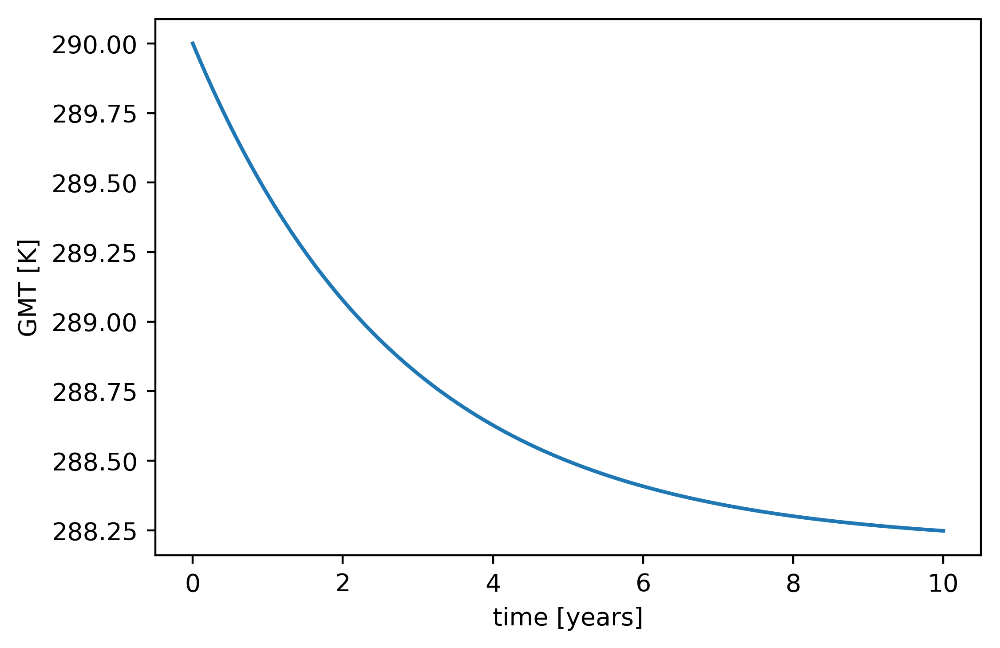

**********
How to use
**********

Here a brief introduction is given on how to get from a given input, which initializes the EBM you want to run, to an output, e.g. the global temperature propagation over time or the temperature distribution over a spatial grid representing the earth.

We will write a small python script, which will do this in a few steps. As it is easier to visualize the output in a plot and modify it, I recommend to perform this steps in a jupyter notebook.

Step 0: Import packages
=======================

Before you can use any module of this package you have to import the core modules::

    import matplotlib as plt
    import numpy as np
    import os
    os.chdir('/insert/your/path/to/the/project/here'+'/Packages')
    from Configuration import importer
    from Variables import variable_importer
    from ModelEquation import model_equation
    from RK4 import rk4alg

This will import all needed modules. Important is that you insert your path to the project so the packages are correctly loaded.
If you dont know the path, go to the command line, locate your project with **cd** and type **pwd**. This will print the current path which you can copy.
(I try to fix this soon so it will do this automatically).

First Step: Import model configuration
======================================

The way this project is built up enables to take any physical function implemented and merge them to create the basis of a desired EBM, which will be our input.
The input will be created manually and is stored in a **configuration.ini** file. Details on how to create and structure this **.ini** file will be given in the :doc:`input <input>`-section. 
.. important::
    the configuration.ini file will provide the physical sense of the EBM!

For now you can simply use the **0DEBM_Config.ini** file which imports a zero-dimensional EBM with a model run over 10 year and stepsize of integration of 1 day.
To import this file go to your .py or .ipynb file and use the *importer*-function::

    configuration=importer('/insert/path/where/your/configurationfiles/are/stored/','filename')

*configuration* is an dictionary which contains all required input parameters. To seperate them for a clearer structure you can use::

    eq=configuration['eqparam']
    rk4=configuration['rk4input']
    fun=configuration['funccomb']

These are three dictionaries which contain the information needed for the base equation, the runge-kutta algorithm and the functions used.

Second Step: Import variables
=============================

As next step the configuration we just imported has to be distributed on different variables. For example arrays of initals conditions are calculated or arrays for the output will be created. To do so we can simply use the *variable_importer*::

    variable_importer(configuration)

Third Step: Let the model/algorithm run
=======================================

Now we are ready to run the algorithm with the *rk4alg* function. It requires the *model_equation* function and the three dictionaries we seperated before (maintain the order)::

    outputdata=rk4alg(model_equation,eq,rk4,fun)

Depending on your settings the algorithm will need some time until it say *Finished!*.

Final Step: Evaluating the output
=================================

From the algorithm you will directly get the *outputdata* array. It is a three-dimensional array of **outputdata=[time, zonal mean temperature, global mean temperature]**. Other variables which are of interest, for example the grid specifications, can be accessed by importing the :doc:` variables <code/variables>` package::

    import Variables as Vars

and then call the desired variables by their name, for example::

    latitudinal_grid=Vars.Lat

For detailed information about output variables see section :doc:` output <output>`.

If you look at the output of the algorithm (with the **0DEBM_Config.ini** file) and plot the global temperature over time with::

    plt.plot(np.array(outputdata[0])/stepsize_of_integration/365,outputdata[2])
    plt.xlabel('time [years]')
    plt.ylabel('GMT [K]')

you get something like this:

.. figure:: _static/GMT12.png
   :align: center
   :width: 80%

    with an initial temperature of 12°C (285K)

    with an initial temperature of 17°C (290K)

Putting it together
===================

The summary of what you need to get the model running. Import package::

    import matplotlib as plt
    import numpy as np
    import os
    os.chdir('/insert/your/path/to/the/project/here'+'/Packages')
    from Configuration import importer
    from Variables import variable_importer
    from ModelEquation import model_equation
    from RK4 import rk4alg

and run the specific functions::

    configuration=importer('/insert/path/where/your/configurationfiles/are/stored/','filename')
    eq=configuration['eqparam']
    rk4=configuration['rk4input']
    fun=configuration['funccomb']
    variable_importer(configuration)
    outputdata=rk4alg(model_equation,eq,rk4,fun)

This demonstration also exists as a jupyter notebook in the *Tutorials/* directive of the project.

    

    
