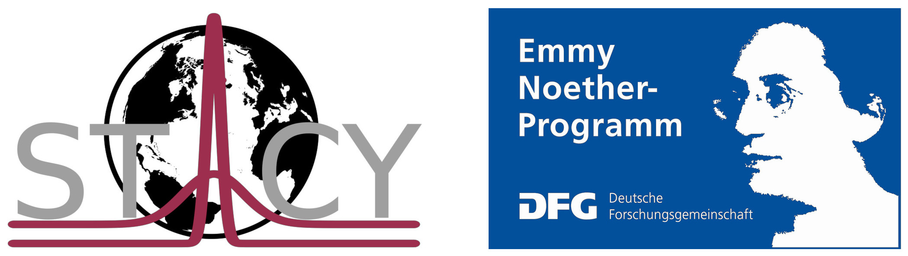

    
************************************
Low-dimensional Energy Balance Models
************************************

This project is a python-implementation of low-dimensional energy balance models (EBMs), built up from a set of physical functions, combined to represent the behaviour of earth's climate through space and time. The implementations of this project are based on a set of publications, especially from :ref:`Michail Budyko <Budyko>` and :ref:`William Sellers <Sellers>`. (For the full list see :doc:`References <references>`).

The project was developed as part of a bachelor thesis at the Institute of Environmental physics, University of Heidelberg, under the supervision of Dr. Kira Rehfeld, group leader of STACY_ (State and timescale-dependency of climate variability from the last Glacial to present day). Funding through the Emmy Noether programme of the German Research foundation is gratefully acknowledged.

.. _STACY: http://www.iup.uni-heidelberg.de/institut/forschung/groups/palaeo/index_stacy.html

This documentation primarily aims on explaining the structure of the sourcecode and show how to use it four your own purpose.
It is now the most well documented sourcecode, so if questions or concerns about implementations come up, please :doc:`contact <contact>` me.

