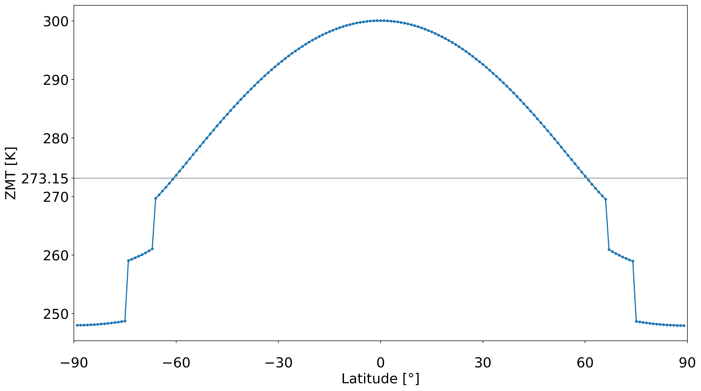
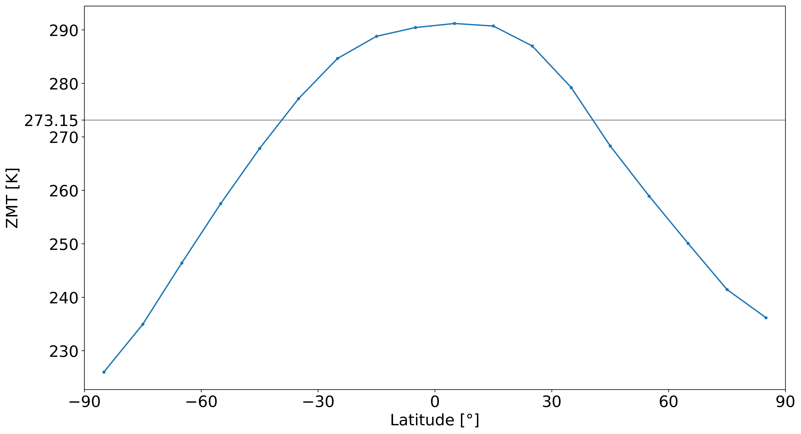

.. _PlaSIM: https://www.mi.uni-hamburg.de/en/arbeitsgruppen/theoretische-meteorologie/modelle/plasim.html

*********************************
Physical Background / Model Types
*********************************

With this project different types of EBMs can be used to run simulations. 
However, the versatility of the resolution is limited to low dimensional EBMs from zero to one dimensionsal EBMs and additionally one dimensional EBMs that are resolved over the latitudes. It would be nice and is planned by me to extent this project to higher resolutions (for more information see :doc:`ToDo <todo>`)

Physical Background
===================

In general, energy balance models describe the behaviour of a planet's energy balance over time. Here, the focus is obviously on the earth's energy balance, but EBMs can simulate the climate of other planets as well, which is done by the PlaSIM_ model for example.

.. figure:: _static/EB.png
    :align: center
    :width: 80%
    
    Earth's energy balance [:doc:`IPCC, 2013 <references>`]

Here shown is a 0D schematic of the earth's energy balance like it is often given in the standard literature. The radiative energy fluxes (in :math:`Wm^{-2}`) of the earth are indicated with their strength and direction. However, EBMs describe the energy balance mostly with the crucial parts only, which means that small or strongly regional energy fluxes are neglected.

EBMs are commonly restricted to the **incoming radiative energy flux** (:math:`R_{in}`), the **outgoing radiative energy flux** (:math:`R_{out}`) and in some cases of 0D-EBMs an **external forcing energy flux** (:math:`F_{ext}`) (e.g. Carbon Dioxide forcing), or in cases of 1D-EBMs to **latitudinal transfer energy fluxes** (:math:`F_{transfer}`). This is of course no necessity rather than a general identification of EBMs since they are specifically characterized by their simplicity.

The physical basis of EBMs can be expressed in a model equation which commonly has the following form:

.. _above:

.. math::

    C \cdot \frac{dT}{dt} = R_{in}(t) + R_{out}(t) + F (t)

where C is the heatcapacity, :math:`\frac{dT}{dt}` the term to consider that the system is dynamical and :math:`R_{in}`, :math:`R_{out}`, :math:`F` the energy fluxes which are commonly included.

Model Types
===========

0D-EBM
------

If one is interested in the 0D case, the model equation above suffices to describe the energy balance over time. However, :math:`F` is neglected in general and only used in specific cases. By using the following discretizations:

.. math::

    R_{in} & = (1-\alpha)\cdot \\
    R_{out} & = - \epsilon\sigma T^4

with the albedo :math:`\alpha`, the solar insolation :math:`Q`, the Stefan-Boltzmann constant :math:`\sigma`, and the emissivity :math`\espilon`, the simplest form of an EBM is described by:

.. math::

    C \cdot \frac{dT}{dt} = R_{in} + R_{out} = (1-\alpha) \cdot Q - \epsilon\sigma T^4

This equation can easily be solved analytically, but to observe the behaviour of the energy balance over time a numerical algorithm can be used to solve this equation.
With the chapter :doc:`How to use <howtouse>` it will be investigated in detail how this project implements such an EBM. Additionally there is a tutorial given once you have :doc:`installed <installation>` this project.

.. Note::

    The dependencies of parameters like :math:`\alpha` on variables like the temperature :math:`T` is strongly related to the inbound type of :doc:`Functions <code/functions>` and is therefore not specified while formulating this model equations.

1D-EBM
------

1D EBMs do not differ much from 0D ones. In 1D EBMs the earth is commonly described by a grid of latitudinal bands.
The model equation as introduced above_ can directly be transfered to be valid for each latitudinal band seperately. 

As already mentioned, 1D EBMs use latitudinal transfer energy fluxes :math:`F_{transfer}` which consider an exchange of energy between those latitudinal bands. This term is crucial, because the energy balance resolved over the latitudes shows strong differences between equator and poles, which is logical due to the stronger insolation at the equator.

By indentifying each latitudinal band and all its parameters with an index i, the simplest form of an 1D-EBM is described by:

.. math::

    C \cdot \frac{dT_i}{dt} = R_{in,i} + R_{out,i} + F_{transfer,i}

There are many different approaches to discretize these terms in 1D. Because this project was started to implement two specific EBMs, one created by :doc:`Michail Budyko <references>` and one by :doc:`William Seller  <references>`, both published in the late 1960s, these two discretizations will be shown. 

Budyko-type model
^^^^^^^^^^^^^^^^^

This EBM constructed by :doc:`Michail Budyko  <references>` uses various assumptions, supported by global earth observation data. The key features of this model are:

- An empirically determined outgoing radiation flux with linear dependence on temperature, in its simplest form described by :math:`R_{out}=A+B\cdot T`.

- An albedo seperated into three different regions with dependence on latitude (or by customization on temperature), with high albedo values towards the polar regions and low albedo values in the equatorial regions.

- A symmetric transfer energy flux with dependence on the difference of zonal (ZMT) to global (GMT) mean temperature.

- A grid resolving latitudinal bands of any width (in this project mostly used is a width of 1°)

The detailed physical formulation of the terms (and additional extensions) can be viewed along with the implementations (:doc:`Functions <code/functions>`).

An example zonal mean temperature distribution:

Sellers-type model
^^^^^^^^^^^^^^^^^^

The EBM constructed :doc:`William Seller  <references>` is adapted even more to global earth observation data and thereby is constructed with more complex terms than the EBM from Budyko. The key features of this model are:

- The Stefan-Boltzmann radiation law as outgoing radiation flux extended with a term considering atmospheric attenuation.

- An albedo described by an empircal law with linear dependence on temperature and surface elevation.

- A transfer energy flux *P* seperated into three different components, the atmospheric water vapour transfer, the atmospheric sensible heat transfer and the oceanic sensible heat transfer. The total transfer energy flux *F* of one gridbox is given by the difference of northward and southward transfer energy flux *P* (the sum of those three components from the northern/southern boundary).

- A grid resolving the earth with latitudinal bands of 10° width. Hence, the earth is resolved by 18 latitudinal bands.

The detailed physical formulation of the terms (and additional extensions) can be viewed along with the implementations (:doc:`Functions <code/functions>`).

An example zonal mean temperature distribution:

